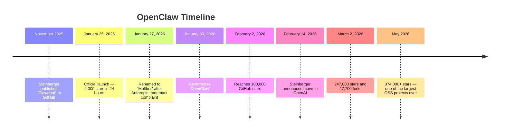
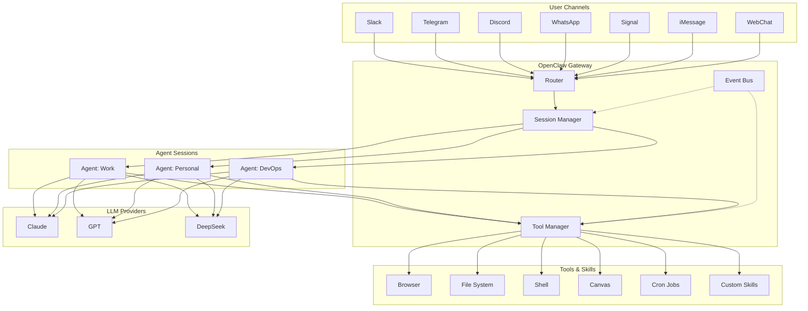
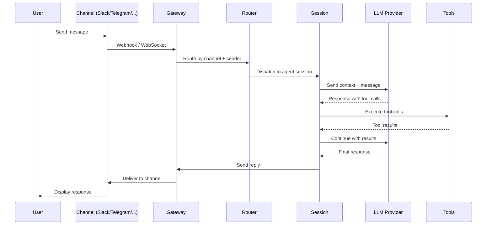
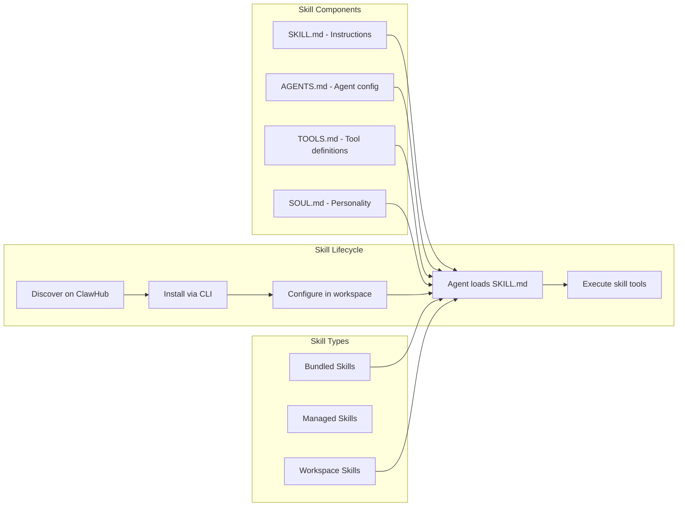
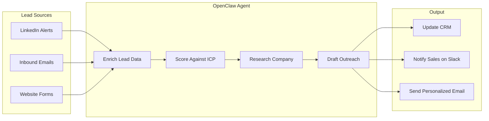
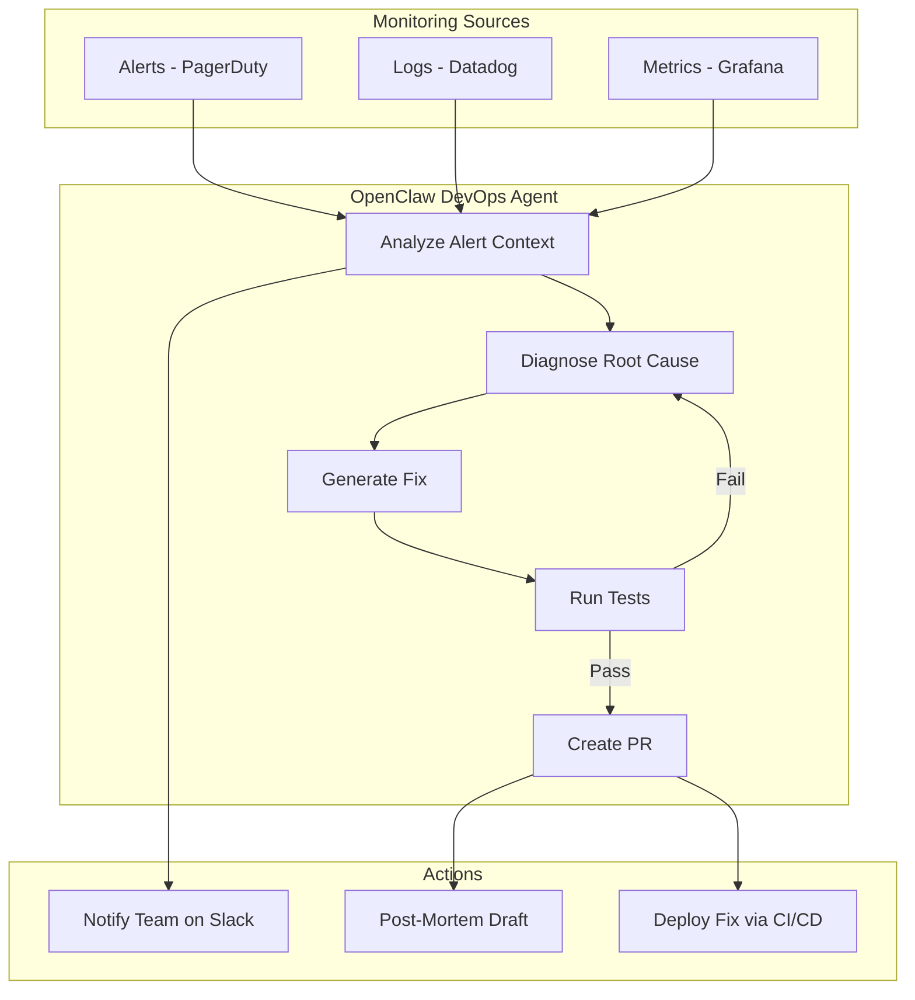
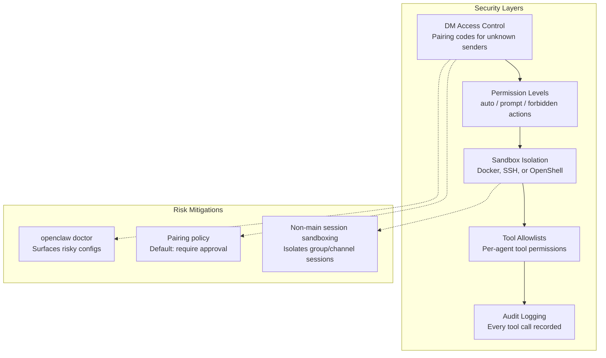
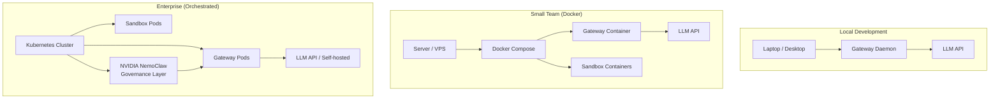

In November 2025, Austrian developer Peter Steinberger quietly pushed a side
project to GitHub. Six months later, it has 374,000 stars, backing from
NVIDIA, OpenAI, and GitHub, and has been called by Jensen Huang "probably
the single most important release of software, probably ever." The project
is **OpenClaw** — an open-source autonomous AI agent framework that doesn't
just answer questions but **executes work**. This post is a comprehensive
deep dive into what OpenClaw is, how it works, why businesses are adopting
it, and what you need to know to get started.


## What is OpenClaw?

OpenClaw is a **personal AI assistant you run on your own devices**. Unlike
cloud-hosted AI chatbots, OpenClaw runs locally, connects to the LLM of
your choice (Claude, GPT, DeepSeek, or others), and interfaces with you
through the messaging platforms you already use — Slack, Telegram, Discord,
WhatsApp, Signal, iMessage, and 20+ more.

But calling OpenClaw a "chatbot" misses the point. OpenClaw is best
understood as an **execution layer** within the modern AI stack. Most AI
systems today focus on reasoning — they generate text, analyze data, and
suggest next steps, but they don't execute those steps. OpenClaw bridges
that gap. It connects AI-generated decisions directly to systems where
work happens, carrying out those decisions automatically.

The key distinction: traditional AI assistants are **conversational**.
OpenClaw is **agentic**. It doesn't wait for you to tell it what to do
step by step — it takes a goal, decomposes it, selects the right tools,
executes, and reports back.

## The Origin Story

The journey from a side project to the fastest-growing open-source project
in history is worth understanding, because it reveals why OpenClaw
resonated so deeply with the developer community.



**Peter Steinberger** is the founder of PSPDFKit, a document SDK deployed on
over a billion devices. When he built Clawdbot, it wasn't a research
prototype — it was a production-grade tool built by someone who understood
what production software demands. That DNA shows in OpenClaw's
architecture: local-first, sandboxed, observable, and extensible.

The naming saga is part of the legend. Originally called **Clawdbot** (a nod
to Anthropic's Claude), it was renamed to **Moltbot** after Anthropic filed
trademark complaints. Three days later, Steinberger renamed it again to
**OpenClaw** because Moltbot "never quite rolled off the tongue." The lobster
mascot stayed, and the community embraced it — contributors are called
"clawtributors," the plugin registry is "ClawHub," and the motto is
"EXFOLIATE! EXFOLIATE!"

On February 14, 2026, Steinberger announced he was joining OpenAI and
transferred OpenClaw to an independent non-profit foundation. The project
remains MIT-licensed, community-governed, and vendor-neutral.

## Architecture Deep Dive

OpenClaw's architecture is centered around a **Gateway** — a local-first
control plane that orchestrates everything.



### The Gateway

The Gateway is a daemon process (launchd on macOS, systemd on Linux) that
listens on a configurable port (default 18789). It is the **single control
plane** for sessions, channels, tools, and events. Critically, the Gateway
is just the orchestration layer — the product is the assistant that emerges
from the interaction between the user, the LLM, and the tools.

### Multi-Agent Routing

One of OpenClaw's most powerful features is **multi-agent routing**. You
can configure different agents for different contexts — a work agent that
connects to your company Slack and has access to your codebase, a personal
agent that handles your Signal messages and calendar, and a DevOps agent
that monitors your infrastructure via Telegram alerts.

Each agent gets its own:
- **Workspace**: isolated file system scope
- **Session history**: persistent memory across conversations
- **Tool permissions**: what the agent can and cannot do
- **LLM configuration**: which model powers it

### Sessions

Sessions are first-class objects in OpenClaw. The system provides tools for
managing them: `sessions_list`, `sessions_history`, `sessions_send`, and
`sessions_spawn`. This enables the agent to maintain context across
interactions and even spawn sub-sessions for complex tasks.

## How Messages Flow Through OpenClaw

Understanding the message flow reveals why OpenClaw feels so responsive
despite its complex architecture.



The flow is asynchronous and non-blocking. While one session is waiting
for an LLM response, others continue processing. The Gateway handles
backpressure, rate limiting, and failover between LLM providers
transparently.

## The Skills Ecosystem

Skills are what make OpenClaw extensible. A skill is a directory containing
a `SKILL.md` file with metadata, instructions, and tool-usage patterns. The
agent reads the skill file and gains new capabilities without code changes.



### Skill Types

- **Bundled skills**: Ship with OpenClaw (browser, canvas, cron, sessions)
- **Managed skills**: Installed from ClawHub, the community registry
- **Workspace skills**: Custom skills you create in
  `~/.openclaw/workspace/skills/`

### ClawHub

ClawHub (clawhub.ai) is the community skill registry. It works like npm
for agent capabilities — you browse, install, and update skills with a
single command. However, ClawHub has also been a source of security
concern (more on this in the Security section).

### Building a Custom Skill

Creating a skill is remarkably simple. You write a `SKILL.md` file
that describes what the skill does, what tools it needs, and how the
agent should use them:

```markdown
---
name: daily-standup
description: Automate daily standup collection and summary
tools:
  - sessions_send
  - cron
---

# Daily Standup Skill

Collect standup updates from team members every morning at 9:00 AM.

## Workflow
1. At 9:00 AM, send a message to each team member asking for:
   - What they did yesterday
   - What they plan to do today
   - Any blockers
2. Wait for responses (timeout: 2 hours)
3. Compile responses into a summary
4. Post the summary to the #standup channel
```

The agent reads this natural language description and executes the workflow
using its available tools. No code required.

## Channel Integrations

OpenClaw supports **25+ messaging platforms**, making it the most broadly
integrated AI agent framework available.

```mermaid
graph TB
    subgraph "Enterprise"
        SL[Slack]
        MT[Microsoft Teams]
        GC[Google Chat]
        MM[Mattermost]
        NC[Nextcloud Talk]
    end

    subgraph "Consumer"
        WA[WhatsApp]
        TG[Telegram]
        SG[Signal]
        IM[iMessage]
        DC[Discord]
    end

    subgraph "Asia-Pacific"
        WE[WeChat]
        QQ[QQ]
        LN[LINE]
        ZL[Zalo]
        FS[Feishu / Lark]
    end

    subgraph "Developer & Social"
        IR[IRC]
        MX[Matrix]
        TW[Twitch]
        NS[Nostr]
        SY[Synology Chat]
    end

    subgraph "Native"
        MC[macOS App]
        IO[iOS Node]
        AN[Android Node]
        WB[WebChat]
    end

    OC((OpenClaw<br/>Gateway))

    SL & MT & GC & MM & NC --> OC
    WA & TG & SG & IM & DC --> OC
    WE & QQ & LN & ZL & FS --> OC
    IR & MX & TW & NS & SY --> OC
    MC & IO & AN & WB --> OC
```



This breadth matters for businesses. Your team uses Slack? Your customers
reach out on WhatsApp? Your DevOps alerts come through Telegram? Your
Asian market uses WeChat? OpenClaw handles all of them through a single
agent configuration.

### DM Routing and Access Control

By default, DMs from messaging platforms are treated as **untrusted
input**. The default DM policy is `"pairing"` — unknown senders receive a
pairing code, and the bot won't process their messages until approved. This
prevents random strangers from interacting with your agent (and your data).

## Business Use Cases

This is where OpenClaw gets interesting for organizations. The combination
of autonomous execution, broad integrations, and the skills system creates
a platform that can automate complex business workflows.

### Use Case 1: Sales Lead Generation and Qualification



**The workflow**: When a new lead comes in (via email, form submission, or
LinkedIn alert), the OpenClaw agent:

1. **Enriches** the lead with company data, recent news, and funding info
2. **Scores** the lead against your Ideal Customer Profile
3. **Researches** the company's tech stack, recent hires, and pain points
4. **Drafts** a personalized outreach email referencing specific details
5. **Updates** your CRM with the enriched data and lead score
6. **Notifies** the assigned sales rep on Slack with a summary

Freelancers and small businesses have been early adopters of this pattern,
using OpenClaw to automate prospect research and outreach that would
otherwise require a dedicated SDR.

### Use Case 2: Customer Support Triage and Resolution

**The workflow**: The agent monitors your support channels (email,
Slack, Discord) and:

1. Categorizes incoming issues by type and severity
2. Searches your knowledge base and documentation for solutions
3. For known issues: drafts a response and queues it for human review
4. For unknown issues: escalates to the right team with full context
5. Tracks resolution time and updates the customer

**Business impact**: Reduces first-response time from hours to seconds.
Companies report 60-70% of L1 support tickets being handled or triaged
without human intervention.

### Use Case 3: DevOps and Infrastructure Monitoring



**The workflow**: When an alert fires, the agent:

1. Analyzes logs and metrics to identify the root cause
2. Searches the codebase for the relevant code
3. Generates and tests a fix locally
4. Creates a PR with the fix and a draft post-mortem
5. Pages a human only if it can't resolve the issue automatically

This is the use case that made Jensen Huang call OpenClaw "probably the
single most important release of software, probably ever."

### Use Case 4: Content Operations

**The workflow**: For content teams, the agent can:

1. Monitor competitor blogs and industry news via RSS/web browsing
2. Generate content briefs based on trending topics and SEO gaps
3. Draft articles with proper formatting, images, and metadata
4. Schedule publishing across platforms
5. Monitor engagement metrics and suggest optimizations

### Use Case 5: Financial Operations and Compliance

**The workflow**: For finance teams:

1. Monitor transactions for anomalies and flag potential compliance issues
2. Generate daily/weekly financial summaries from accounting systems
3. Reconcile invoices against purchase orders
4. Draft compliance reports for regulatory requirements
5. Alert the CFO via their preferred channel when thresholds are exceeded

### Use Case 6: HR and Recruitment

**The workflow**: The agent automates recruitment pipeline tasks:

1. Screen incoming resumes against job requirements
2. Schedule interviews by coordinating calendars
3. Send status updates to candidates
4. Compile interview feedback from the team
5. Generate offer letter drafts

## Security Model

Security is the most contentious aspect of OpenClaw — and rightfully so.
An autonomous agent with access to your email, calendar, file system,
and messaging platforms is powerful but dangerous if misconfigured.



### Default Security Posture

- **DM policy**: `"pairing"` — unknown senders must be approved
- **Main session**: Runs on host with full access (it's just you)
- **Non-main sessions**: Can be sandboxed via Docker by setting
  `agents.defaults.sandbox.mode: "non-main"`
- **Default sandbox permissions**: Allow bash, process, read, write, edit,
  session tools. Deny browser, canvas, nodes, cron, discord, gateway.

### The ClawHub Malware Incident

In February 2026, Bitdefender scanned ClawHub and found **nearly 900
malicious packages** — almost 20% of the registry. Some accounts were
uploading poisoned skills every few minutes using automated scripts. This
is the npm/PyPI supply chain attack problem, amplified by the fact that
malicious skills can instruct an AI agent to exfiltrate data or execute
arbitrary commands.

**Cisco's AI security team** tested a third-party skill and confirmed it
performed data exfiltration and prompt injection without user awareness.

**Lessons for businesses**: Treat the ClawHub registry like you treat npm
— vet third-party packages, pin versions, and audit regularly. Use only
bundled or workspace skills for sensitive operations. Run `openclaw doctor`
to surface risky configurations.

### Prompt Injection Risks

Because OpenClaw processes messages from external sources (email, chat,
web pages), it's susceptible to **prompt injection** — malicious
instructions embedded in data that trick the LLM into treating them as
legitimate commands. A carefully crafted email could, in theory, instruct
the agent to forward sensitive data to an attacker.

**Mitigations**: Use sandboxing for all non-main sessions, restrict tool
permissions to the minimum needed, and never give agents write access to
systems they shouldn't modify.

## Deployment Models

OpenClaw supports multiple deployment topologies, from a developer's
laptop to an enterprise fleet.



### Local (Developer / Freelancer)

The simplest deployment. Install via npm, run `openclaw onboard`, and
you're up in minutes. The gateway runs as a daemon, and you interact
through your preferred messaging app.

```bash
npm install -g openclaw@latest
openclaw onboard --install-daemon
```

### Docker (Small Team)

For teams, Docker Compose provides isolation and reproducibility. The
included `docker-compose.yml` sets up the gateway and sandbox containers.
Configuration is mounted via volumes, and the agent persists state across
restarts.

### Cloud (Fly.io / Render)

OpenClaw ships with `fly.toml` and `render.yaml` for one-click deployment
to cloud platforms. This is ideal for teams that want a shared agent
accessible from anywhere without managing infrastructure.

### Enterprise (Kubernetes + NemoClaw)

For enterprises, NVIDIA's **NemoClaw** adds a governance layer on top of
OpenClaw with security policies, execution controls, audit trails, and
compliance features. This is the path for organizations that need SOC 2
compliance, role-based access control, and centralized management.

## Getting Started

### Prerequisites

- **Node.js 24** (recommended) or Node.js 22.19+
- An API key for your preferred LLM provider

### Installation

```bash
npm install -g openclaw@latest
openclaw onboard --install-daemon
```

The `onboard` command walks you through:

1. **Gateway setup**: Configuring the daemon and port
2. **LLM configuration**: Setting your preferred model and API key
3. **Channel setup**: Connecting your first messaging platform
4. **First skill**: Installing a starter skill from ClawHub

### Minimal Configuration

Your configuration lives at `~/.openclaw/openclaw.json`:

```json
{
  "agent": {
    "model": "anthropic/claude-sonnet-4-6"
  },
  "channels": {
    "telegram": {
      "enabled": true,
      "token": "YOUR_BOT_TOKEN"
    }
  },
  "security": {
    "dmPolicy": "pairing",
    "sandbox": {
      "mode": "non-main"
    }
  }
}
```

### Chat Commands

Once running, you can control the agent through chat commands:

| Command | Description |
|---------|-------------|
| `/status` | Show agent status and active sessions |
| `/new` | Start a new session |
| `/reset` | Clear session history |
| `/compact` | Compress context to save tokens |
| `/think <level>` | Set reasoning depth |
| `/verbose on/off` | Toggle detailed responses |
| `/usage off/tokens/full` | Control usage display |
| `/restart` | Restart the gateway |

## OpenClaw vs. Other Agent Frameworks

How does OpenClaw compare to other approaches?

| Feature | OpenClaw | Claude Code | AutoGPT | LangChain Agents |
|---------|----------|-------------|---------|------------------|
| **Deployment** | Self-hosted, local-first | Cloud + CLI | Self-hosted | Framework (build your own) |
| **Messaging integrations** | 25+ platforms | Terminal/IDE | Web UI | Custom |
| **Skills/plugins** | ClawHub ecosystem | Built-in tools | Plugins | Tools/chains |
| **Multi-agent** | Native routing | Single agent | Single agent | Multi-agent support |
| **Voice** | macOS, iOS, Android | No | No | No |
| **Canvas/UI** | Live Canvas (A2UI) | No | No | No |
| **Sandbox** | Docker/SSH/OpenShell | Built-in sandbox | Limited | No |
| **License** | MIT | Proprietary | MIT | MIT |
| **Maturity** | 6 months, massive community | Production, Anthropic-backed | 2+ years | 3+ years |

OpenClaw's unique advantage is the combination of **local-first
architecture**, **broad messaging integrations**, and a **thriving
ecosystem**. Its weakness is the security surface area that comes with
that breadth.

## The Industry Response

OpenClaw's impact has been seismic and polarizing:

- **NVIDIA**: CEO Jensen Huang called it "probably the single most important
  release of software, probably ever." NVIDIA built NemoClaw as a
  governance layer.
- **Microsoft**: CEO Satya Nadella initially called OpenClaw a "virus"-like
  security risk. By May 2026, Microsoft was internally testing "ClawPilot"
  (Project Lobster), an OpenClaw-based desktop environment.
- **Google**: Began building "Remy," a competing agent framework.
- **China**: The government restricted OpenClaw in state agencies citing
  security risks, while simultaneously encouraging local governments to
  build industry around it. Tencent and Z.ai launched OpenClaw-based
  services. Investors pursued the "lobster trade."
- **OpenAI**: Hired Steinberger. Became a sponsor.

## The Road Ahead

OpenClaw is now governed by an independent non-profit foundation. The
project is MIT-licensed and community-driven. With 374,000+ stars, 77,600+
forks, and 51,000+ commits from hundreds of contributors, it has achieved
escape velocity as an open-source project.

Key developments to watch:

- **Enterprise governance**: NemoClaw and similar governance layers will
  determine whether OpenClaw can meet corporate compliance requirements
- **Skill quality and safety**: The ClawHub malware incident showed that
  the skills ecosystem needs better vetting, signing, and sandboxing
- **Platform competition**: As Microsoft, Google, and others build
  competing agents, OpenClaw's open-source, vendor-neutral positioning
  becomes both its greatest strength and its biggest challenge
- **Regulatory landscape**: Governments worldwide are grappling with how
  to regulate autonomous AI agents. OpenClaw's broad adoption makes it a
  focal point for these discussions

## Conclusion

OpenClaw represents a fundamental shift in how we interact with AI. It
moves AI from a **conversational tool** to an **execution platform** — from
"ask me anything" to "let me handle that." For businesses, it offers the
promise of automating complex workflows across every communication channel.
For developers, it provides an extensible, open-source foundation for
building autonomous systems.

But with that power comes real responsibility. The security surface area is
vast, the skill ecosystem needs maturing, and the line between "helpful
automation" and "uncontrolled autonomous action" requires careful
guardrails (as the MoltMatch dating-profile incident demonstrated).

The lobster is out of the tank. Whether OpenClaw becomes the Linux of AI
agents — ubiquitous, foundational, and trusted — depends on how the
community addresses these challenges. What's already clear is that the
question is no longer "should we use AI agents?" but "how do we deploy
them responsibly?"

The answer starts with understanding what you're deploying. And now you do.
